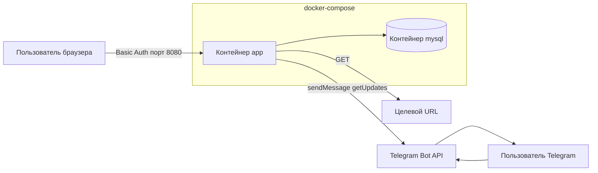
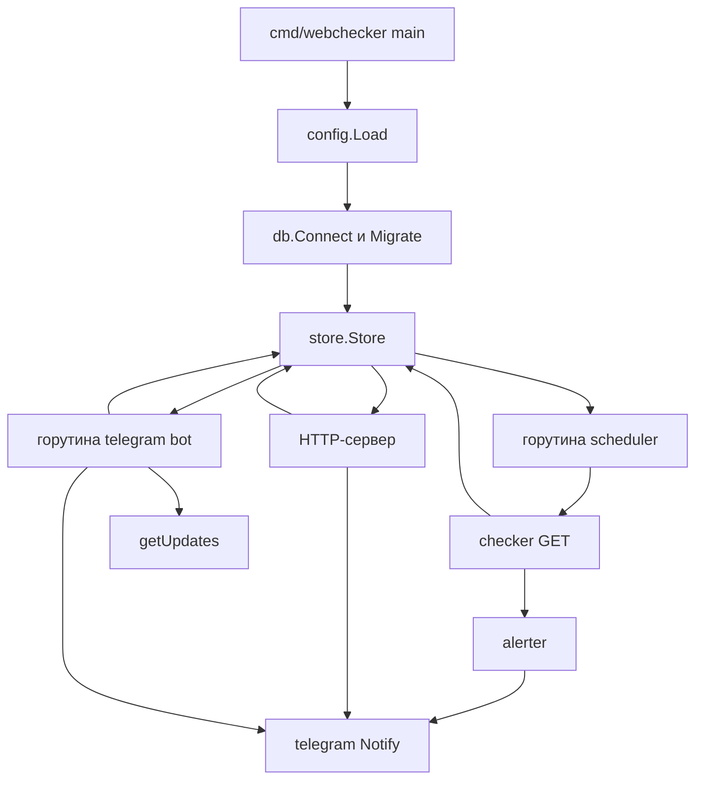
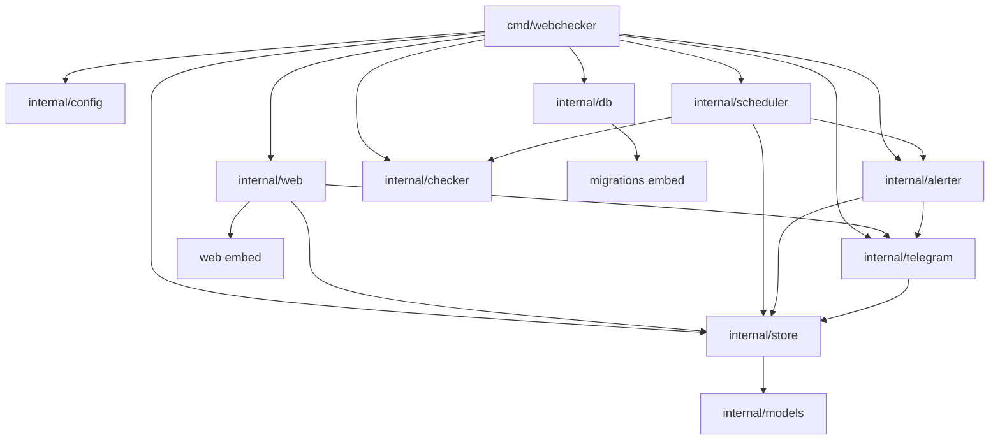

# Архитектура и структура репозитория

## Назначение

webChecker решает одну задачу: с заданным интервалом проверять список URL и отвечать на вопросы «доступен ли адрес», «какой статус вернулся» и «сколько длился ответ».

Это **один процесс Go** внутри Docker. В том же compose поднимается MySQL. Отдельных микросервисов нет: HTTP-сервер, планировщик проверок и Telegram-бот живут в одном бинаре и делят одно подключение к БД.

## Контейнеры



- **mysql** — образ `mysql:8.4`, том `mysql_data`, healthcheck через `mysqladmin ping`.
- **app** — multi-stage сборка: `golang:1.26-alpine` → минимальный `alpine` с бинарём. Ждёт healthy MySQL, публикует `8080`.
- HTML, CSS и JS вшиты в бинарь через `embed.FS`, отдельные файлы шаблонов в образ копировать не нужно.

При старте контейнер `app` повторяет подключение к MySQL (до 30 попыток) и применяет SQL-миграции.

## Процесс приложения

После успешного подключения к БД `main` запускает три независимых контура:



| Контур | Где | Что делает |
| --- | --- | --- |
| Планировщик | `internal/scheduler` | Раз в секунду выбирает due-мониторы и отдаёт их воркерам. При старте фазы разносит по `id % interval` и, если есть, по последней проверке в БД |
| HTTP | `internal/web` | Дашборд, CRUD, статистика, настройки, экспорт/импорт |
| Бот | `internal/telegram` | Long polling `getUpdates`, команды `list` / `stat` / `help` |

Остановка: SIGINT/SIGTERM → отмена контекста → graceful shutdown HTTP (до 10 с). Планировщик и бот выходят по тому же контексту.

## Пакеты



Зависимости направлены внутрь: UI, бот и планировщик ходят в `store`, а не напрямую в SQL из хендлеров (кроме ping БД через store). Шаблоны не импортируют `internal`.

## Структура репозитория

```
webChecker/
├── cmd/webchecker/main.go      точка входа: конфиг, БД, горутины, HTTP
├── internal/
│   ├── config/                 чтение и проверка переменных окружения
│   ├── db/                     подключение MySQL, runner миграций
│   ├── models/                 структуры Monitor, Check, Dump, статистика
│   ├── store/                  SQL: CRUD, проверки, алерты, экспорт/импорт
│   ├── checker/                HTTP GET, измерение latency, ok/slow
│   ├── scheduler/              тик, пул воркеров, retention
│   ├── alerter/                антиспам и тексты Telegram-алертов
│   ├── telegram/               Bot API: sendMessage, getUpdates, команды
│   └── web/                    маршруты, Basic Auth, формы, шаблоны
├── web/
│   ├── embed.go                //go:embed templates и static
│   ├── templates/              layout, dashboard, form, stats, settings
│   └── static/
│       ├── css/app.css
│       └── js/app.js, chart.umd.min.js
├── migrations/
│   ├── embed.go
│   └── 001_init.sql            monitors, checks, alert_states
├── docs/                       эта документация
├── Dockerfile
├── docker-compose.yml
├── .env.example
├── go.mod                      module webchecker, Go 1.26
└── README.md
```

Правила размещения кода:

- бизнес-логика только в `internal/` — снаружи модуля эти пакеты не импортируются;
- страницы не собираются из строк в Go: HTML/CSS/JS лежат отдельными файлами;
- SQL схемы версионируются файлами в `migrations/`, при старте пишутся в `schema_migrations`.

## HTTP-слой

Сервер — стандартный `net/http.ServeMux` (Go 1.22+). Все страницы, кроме `GET /healthz`, закрыты HTTP Basic Auth. Логин и пароль — из env, сравнение через `crypto/subtle`.

| Метод | Путь | Назначение |
| --- | --- | --- |
| GET | `/healthz` | Готовность: ping MySQL, без auth |
| GET | `/` | Дашборд мониторов, автообновление 30 с |
| GET | `/monitors/new` | Форма нового URL |
| POST | `/monitors` | Создание |
| GET | `/monitors/{id}` | Статистика, таблица проверок, график |
| GET | `/monitors/{id}/edit` | Форма правки |
| GET | `/monitors/{id}/checks.json` | Точки графика latency |
| POST | `/monitors/{id}` | Сохранение |
| POST | `/monitors/{id}/delete` | Удаление |
| POST | `/monitors/{id}/toggle` | Вкл/выкл |
| GET | `/settings` | Telegram, retention, экспорт/импорт |
| POST | `/settings/telegram-test` | Тестовое сообщение (не зависит от флага алертов) |
| GET | `/settings/export` | JSON-дамп БД |
| POST | `/settings/import` | Замена данных из JSON |
| GET | `/static/` | CSS и JS из embed |

Формы — обычный POST и redirect. JavaScript нужен для графика Chart.js и `confirm` при удалении/импорте.

## Внешние зависимости

Минимальный набор:

- стандартная библиотека Go (`net/http`, `html/template`, `database/sql`, `embed`);
- `github.com/go-sql-driver/mysql`;
- Telegram — сырой HTTPS к `api.telegram.org`, без SDK.

Время в БД хранится и сравнивается как UTC (`parseTime=true&loc=UTC`). Отображение в UI и в боте — локальное, в Docker задаётся `TZ` (по умолчанию `Europe/Moscow`).
