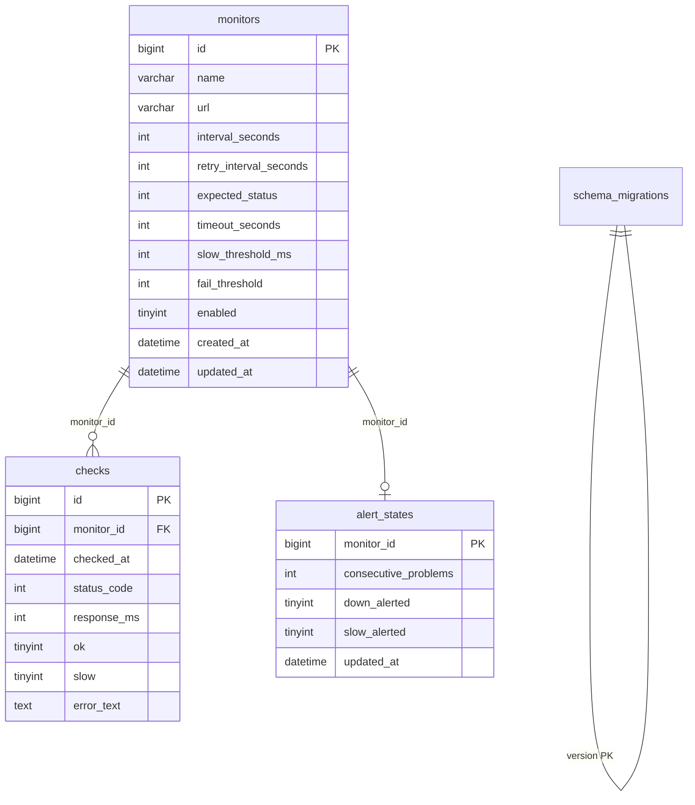

# Модель данных

Данные приложения лежат в MySQL. Секреты Telegram и пароли в таблицы не пишутся — только в переменные окружения.

## Обзор связей


```mermaid
erDiagram
  monitors ||--o{ checks : "monitor_id"
  monitors ||--o| alert_states : "monitor_id"
  schema_migrations ||--|| schema_migrations : "version PK"

  monitors {
    bigint id PK
    varchar name
    varchar url
    int interval_seconds
    int retry_interval_seconds
    int expected_status
    int timeout_seconds
    int slow_threshold_ms
    int fail_threshold
    tinyint enabled
    datetime created_at
    datetime updated_at
  }

  checks {
    bigint id PK
    bigint monitor_id FK
    datetime checked_at
    int status_code
    int response_ms
    tinyint ok
    tinyint slow
    text error_text
  }

  alert_states {
    bigint monitor_id PK
    int consecutive_problems
    tinyint down_alerted
    tinyint slow_alerted
    datetime updated_at
  }
```

Удаление монитора каскадом удаляет его `checks` и `alert_states`.

## Таблица `monitors`

Настройки одной проверки. Строка = один URL.

| Поле | Смысл | Ограничения в UI |
| --- | --- | --- |
| `id` | Идентификатор, его же ждут команды `/stat <id>` | автоинкремент |
| `name` | Человекочитаемое имя | 1–255 символов |
| `url` | Адрес проверки | `http://` или `https://`, до 2048 |
| `interval_seconds` | Пауза между стартами проверок после успеха | 10–86400, по умолчанию 60 |
| `retry_interval_seconds` | Пауза после неуспешной проверки (`ok = 0`) | 1…`interval_seconds`, по умолчанию 10 |
| `expected_status` | Какой HTTP-код считается успехом | 100–599, по умолчанию 200 |
| `timeout_seconds` | Дедлайн GET | 1–120, по умолчанию 10 |
| `slow_threshold_ms` | Порог «долгого» ответа | 1–600000, по умолчанию 3000 |
| `fail_threshold` | Сколько подряд проблем до алерта | 1–100, по умолчанию 3 |
| `enabled` | Участвует ли в планировщике | чекбокс, по умолчанию вкл. |
| `created_at` / `updated_at` | Служебные метки | DATETIME(3) |

Планировщик читает только `enabled = 1`. Выключенный монитор остаётся в дашборде со статусом «Выключен».

## Таблица `checks`

Одна строка — один факт проверки. Это сырьё для uptime, графиков и `/stat <id>`.

| Поле | Смысл |
| --- | --- |
| `id` | Первичный ключ |
| `monitor_id` | Ссылка на монитор |
| `checked_at` | Момент проверки, UTC |
| `status_code` | Код ответа или `NULL`, если сети/таймаута не было ответа |
| `response_ms` | Длительность запроса в миллисекундах (включая чтение тела до 1 МиБ) |
| `ok` | `1`, если нет ошибки транспорта и `status_code == expected_status` |
| `slow` | `1`, если `response_ms >= slow_threshold_ms` (в том числе при таймауте) |
| `error_text` | Текст ошибки или «unexpected status» |

Индексы:

| Индекс | Зачем |
| --- | --- |
| `(monitor_id, checked_at)` | выборки истории и графика по одному URL |
| `checked_at` | удаление старых записей |
| `(monitor_id, id)` | «последняя проверка каждого монитора» для дашборда и seed планировщика |

Последний индекс добавляет миграция `003_checks_monitor_id_index.sql`. Без него `SELECT monitor_id, MAX(id) FROM checks GROUP BY monitor_id` читает таблицу целиком на каждую загрузку дашборда, а дашборд ещё и обновляется сам каждые 30 секунд.

Запись **не обновляется**: история только наращивается. Старые строки удаляет планировщик раз в час, если `checked_at` старше `STATS_RETENTION_DAYS` (по умолчанию 30). Удаление идёт батчами по 5000 строк: одиночный `DELETE` на миллионах записей держит долгую блокировку.

## Таблица `alert_states`

Служебное состояние антиспама: одно на монитор.

| Поле | Смысл |
| --- | --- |
| `monitor_id` | PK и FK на `monitors` |
| `consecutive_problems` | Сколько подряд проверок были проблемой |
| `down_alerted` | Уже отправили «URL недоступен» |
| `slow_alerted` | Уже отправили «долгий ответ» |
| `updated_at` | Время последнего сохранения |

Пока флаг `*_alerted` равен 1, повторные сообщения того же типа не уходят. После успешной проверки оба флага сбрасываются (и при необходимости уходит «восстановлен»). Если отправка в Telegram не удалась, флаг не ставится — алерт повторится на следующем тике.

## Таблица `schema_migrations`

Создаётся runner’ом в `internal/db`. Хранит имена применённых файлов из `migrations/`; применённый файл повторно не выполняется.

DDL в MySQL не откатывается, поэтому сбой на середине файла мог бы оставить схему в промежуточном состоянии без отметки о применении — и следующий старт падал бы на `duplicate column`. Чтобы этого не было, миграции написаны идемпотентно: `CREATE TABLE IF NOT EXISTS`, а `ALTER TABLE` и `CREATE INDEX` обёрнуты проверкой `information_schema` через `PREPARE`/`EXECUTE`. Все statement'ы одного файла выполняются на одном соединении (`sql.DB.Conn`), иначе сессионные переменные и `PREPARE` не увидели бы друг друга: пул раздал бы запросы разным соединениям.

## Производные представления

В коде, не в SQL VIEW:

**DashboardRow** — монитор + последняя проверка + uptime за 24 часа. Состояние для бейджа:

| Состояние | Условие |
| --- | --- |
| `disabled` | `enabled = 0` |
| `pending` | ещё не было ни одной проверки |
| `down` | последняя проверка `ok = 0` |
| `slow` | `ok = 1` и `slow = 1` |
| `ok` | иначе |

**PeriodStats / MonitorStats** — агрегаты `COUNT`, `SUM(ok)`, `SUM(slow)`, `AVG/MIN/MAX(response_ms)` за 24 часа и 7 дней. Uptime = доля `ok` среди всех проверок окна. Медленный, но успешный ответ увеличивает uptime и счётчик «медленных».

## JSON-дамп (экспорт / импорт)

Файл с версии `1`:

```json
{
  "version": 1,
  "exported_at": "2026-09-17T12:00:00Z",
  "monitors": [ ],
  "checks": [ ],
  "alert_states": [ ]
}
```

Экспорт пишется потоком, строка за строкой, поэтому размер истории не влияет на память процесса. Режим «Только настройки» (`/settings/export?checks=0`) оставляет массив `checks` пустым.

Импорт выполняется в одной транзакции: очищаются `checks`, `alert_states`, `monitors`, затем вставляются строки из файла (проверки — пачками по 500). Идентификаторы сохраняются, если они заданы; иначе в `id` уходит `NULL` и MySQL назначает свои. После коммита `AUTO_INCREMENT` обеих таблиц сдвигается за максимальный импортированный id. Импорт **полностью заменяет** текущие данные и на время работы останавливает планировщик. Предел размера файла — 512 МиБ, в памяти держится не больше 8 МиБ.

## Конфигурация вне БД

| Переменная | Роль |
| --- | --- |
| `BASIC_AUTH_*` | Доступ к UI |
| `MYSQL_*` | Подключение |
| `TELEGRAM_BOT_TOKEN`, `TELEGRAM_CHAT_ID` | Куда писать и откуда принимать команды |
| `TELEGRAM_ENABLED` | Слать ли алерты down/slow/recovery. Тестовая кнопка работает при заданных токене и chat id даже если флаг выключен |
| `TELEGRAM_SLOW_ALERTS` | Считать ли медленный ответ проблемой для Telegram |
| `STATS_RETENTION_DAYS` | Срок жизни `checks` |
| `CHECKER_WORKERS` | Размер пула параллельных GET |
| `CHECK_BLOCK_PRIVATE_HOSTS` | Запретить проверки внутренних адресов (loopback, приватные диапазоны, link-local). По умолчанию `false` |
| `HTTP_ADDR` | Адрес слушателя |
| `TZ` | Пояс для подписей времени |

Если токен и chat id заданы, а `TELEGRAM_ENABLED` пустой, алерты включаются. Явный `false` их выключает.
