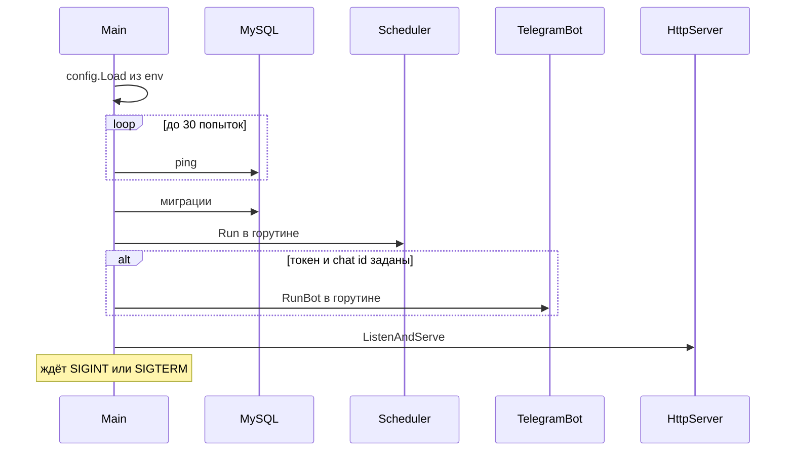
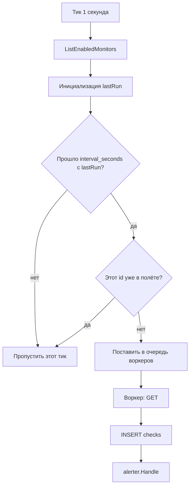
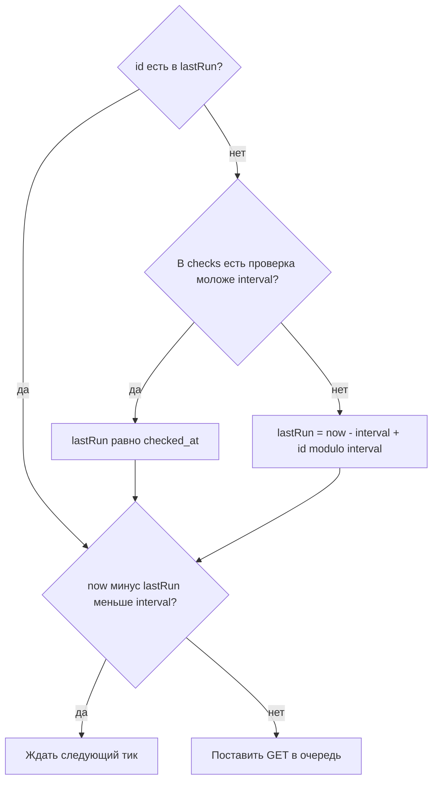
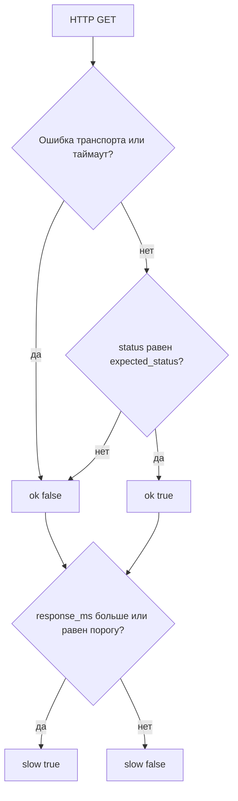
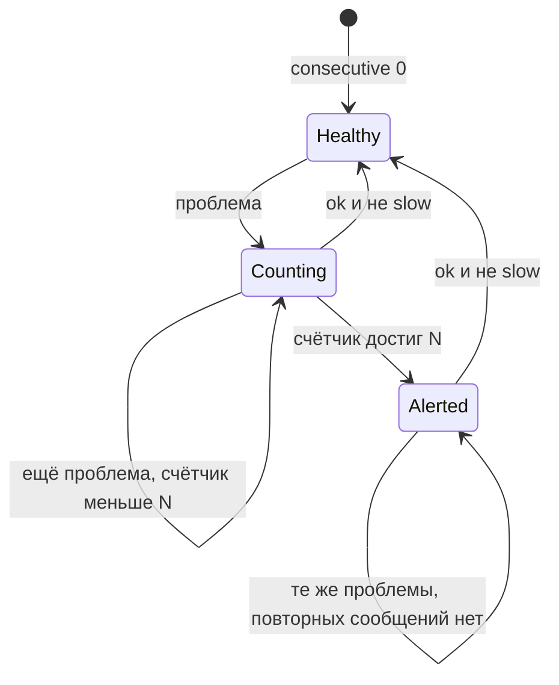
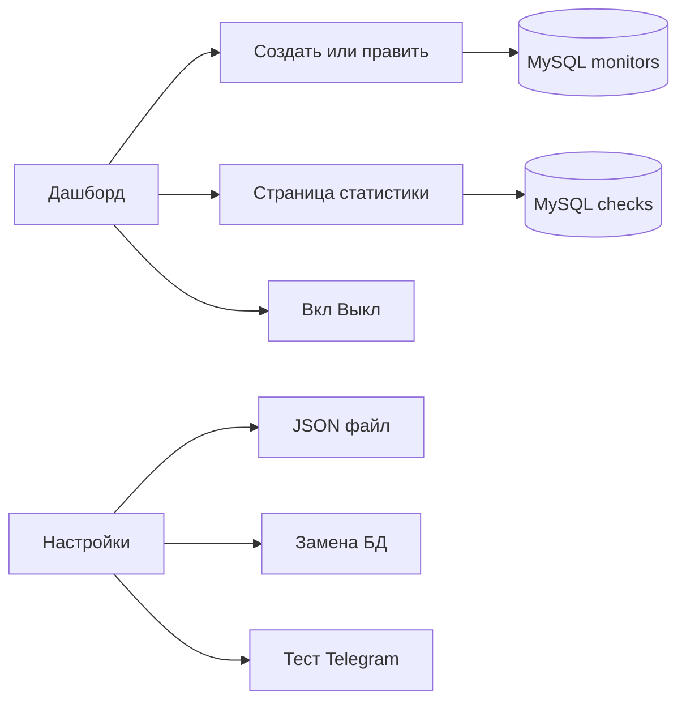

# Логика работы

Документ описывает поведение процесса от старта до алерта и ответа бота.

## Старт

Пока MySQL не готов, процесс не открывает UI. `/healthz` станет `200 ok` только после ping.

## Цикл проверки URL

Планировщик тикает каждую секунду и заново читает включённые мониторы из БД. Изменение интервала, URL или выключение в UI подхватывается без перезапуска.

Правила очереди:

- один монитор не проверяется параллельно (`inFlight`);
- `lastRun` ставится в момент постановки в очередь, интервал считается между стартами, а не между окончаниями;
- если канал воркеров заполнен, слот снимается и монитор попробуют снова через секунду;
- число воркеров — `CHECKER_WORKERS` (по умолчанию 8);
- редиректы: не больше 5.

Раз в час (и сразу при старте) удаляются проверки старше `STATS_RETENTION_DAYS`.

## Разнесение проверок при старте

Без смещения после рестарта все enabled-мониторы оказывались due в одну секунду: карта `lastRun` в памяти пустая. Пул воркеров только сглаживал пик. Если интервалы одинаковые, всем выставлялся почти один `lastRun`, и пачка повторялась каждый цикл.

Поэтому слот **не** считается «пора проверять», пока для id нет `lastRun`. Сначала выбирается фаза (`internal/scheduler`, функция `initialLastRun`).

Два правила:

1. **Свежая история.** Если последняя строка в `checks` ещё не старше интервала, `lastRun = checked_at`. После рестарта URL, который проверяли 10 с назад при интервале 60 с, подождёт 50 с, а не уйдёт в пачку вместе со всеми.
2. **Иначе хеш-фаза.** `lastRun = now - interval + (id % interval)` секунд. Нет истории или последняя проверка слишком старая — мониторы равномерно разъезжаются по окну своего интервала.

Примеры при `interval_seconds = 60` и пустой истории:

| id | `id % 60` | Первая проверка после старта |
| --- | --- | --- |
| 60 | 0 | сразу |
| 1 | 1 | через 1 с |
| 30 | 30 | через 30 с |
| 59 | 59 | через 59 с |

У каждого монитора свой модуль: интервал 30 с даёт 30 слотов, интервал 120 с — 120. Смещение детерминированное, после рестарта те же id попадают в те же слоты, если истории нет. Новая запись без `checks` тоже ждёт свой слот, а не стартует мгновенно.

Когда проверка реально ставится в очередь, `lastRun` перезаписывается текущим временем. Дальше работает обычный интервал, фазы больше не схлопываются.

Код: [internal/scheduler/scheduler.go](../internal/scheduler/scheduler.go). Схема БД и UI не менялись.

## Как классифицируется ответ

Checker делает `GET` с заголовками `User-Agent: webChecker/1.0` и `Accept: */*`. Таймаут берётся из монитора. Время считается от `Do` до конца чтения тела (не больше 1 МиБ).

Примеры:

- сайт отвечает `200` за 120 мс при пороге 3000 мс → `ok`, не `slow`;
- сайт отвечает `200` за 4000 мс при пороге 3000 мс → `ok` и `slow` (доступен, но медленный);
- сайт отвечает `500` при ожидаемом `200` → не `ok`;
- таймаут 10 с при пороге 3000 мс → не `ok`, `slow` (время ожидания уже больше порога), `status_code` пустой.

Дашборд для последней проверки показывает `down`, если не `ok`; иначе `slow`, если медленно; иначе `ok`.

## Алерты Telegram

Алерты — это не «каждое падение», а смена устойчивого состояния. Порог устойчивости — `fail_threshold` монитора (N подряд проблем).

Проблема для счётчика:

- `ok = false`, или
- `slow = true` **и** включён `TELEGRAM_SLOW_ALERTS`.

Если `TELEGRAM_SLOW_ALERTS=false`, медленный успешный ответ счётчик не увеличивает и сообщение «долгий ответ» не уходит.

При переходе в Alerted:

1. если не `ok` и ещё не `down_alerted` → «URL недоступен»;
2. если slow-проблема и ещё не `slow_alerted` → «Долгий ответ»;
3. оба сообщения могут уйти на одной проверке (таймаут: и недоступен, и медленный).

При возврате в норму, если раньше был любой алерт → одно сообщение «URL восстановлен», флаги сбрасываются.

Тестовая кнопка в настройках вызывает `Send`, а не `Notify`. Она проверяет доставку в чат и **не требует** `TELEGRAM_ENABLED=true`. Непрошенные алерты требуют и конфигурацию, и `TELEGRAM_ENABLED`.

Команды бота принимаются только из `TELEGRAM_CHAT_ID`. Сообщения из других чатов отбрасываются.

## Команды бота

Long polling: `getUpdates` с таймаутом 25 с. Перед циклом вызывается `deleteWebhook`, чтобы polling не конфликтовал с webhook.

| Ввод | Ответ |
| --- | --- |
| `list`, `/list` | таблица `id \| имя \| url` |
| `stat`, `/stat` | `id \| имя \| статус` |
| `/stat 3`, `/stat3`, `stat_3`, `/stat id=3` | карточка статистики одного URL |
| `help`, `/start` | список команд |

Статистика по id читает монитор, последнюю проверку и агрегаты 24ч/7д. Если id нет — «Монитор N не найден».

## Web-интерфейс

Пользователь работает с теми же таблицами, что и планировщик.

Валидация формы на сервере: схема URL, диапазоны интервала, статуса, таймаута, порога мс и N. Некорректная форма рисуется снова с текстом ошибки, запись в БД не идёт.

График на странице монитора запрашивает `/monitors/{id}/checks.json` (до 200 последних точек) и рисует Chart.js; если библиотека не загрузилась, есть запасной canvas.

## Типичные сценарии

**Добавили URL.** В `lastRun` его ещё нет, истории в `checks` тоже нет → первая проверка в слоте `id % interval` (не обязательно сразу). Дальше — каждый `interval_seconds`.

**Перезапуск процесса.** Свежие `checked_at` восстанавливают фазу из БД. URL без недавней проверки разъезжаются по `id % interval`, а не стартуют все в одну секунду.

**Порог N = 3, сеть моргнула один раз.** Счётчик 1, затем успех сбрасывает его в 0. Telegram молчит.

**Три таймаута подряд.** После третьего — «недоступен» и при включённых slow-алертах «долгий ответ». Пока URL лежит, новых копий этих сообщений нет. Первый нормальный ответ — «восстановлен».

**Экспорт перед обновлением.** «Настройки → Скачать JSON». На новой среде — импорт. Планировщик начнёт проверять импортированные мониторы как обычно; история checks уже в файле.

## Наблюдаемость

Логи — `log/slog` в stdout контейнера.

Полезные сообщения:

- `telegram configured=... alerts=... slow_alerts=...` при старте;
- предупреждение, если токен есть, а `TELEGRAM_ENABLED=false`;
- `check problem` при `ok=false` или `slow=true`;
- `telegram alert kind=down|slow|recovery`;
- `telegram alert skipped` если алерты выключены;
- `telegram command ignored: chat id mismatch`.

`GET /healthz` без пароля удобен для Docker/балансировщика: `200` только при живой БД.
