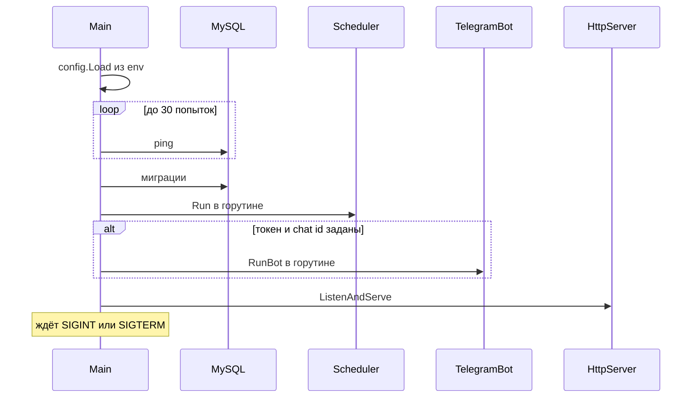
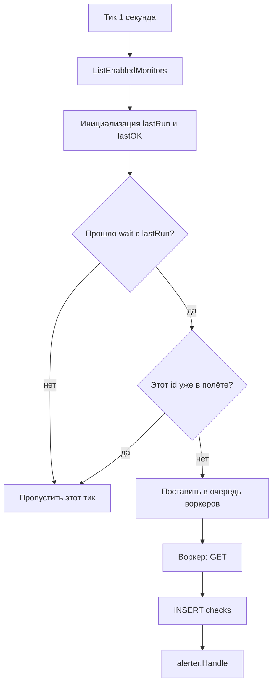
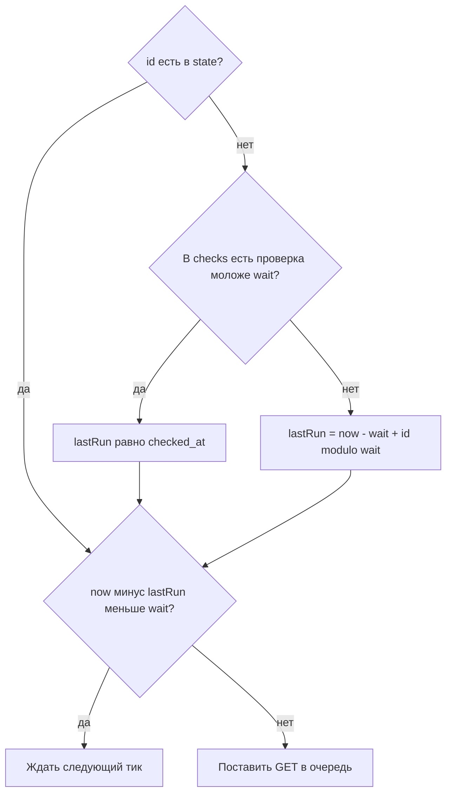
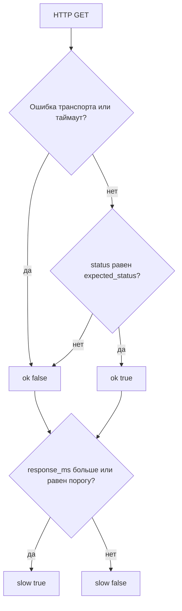
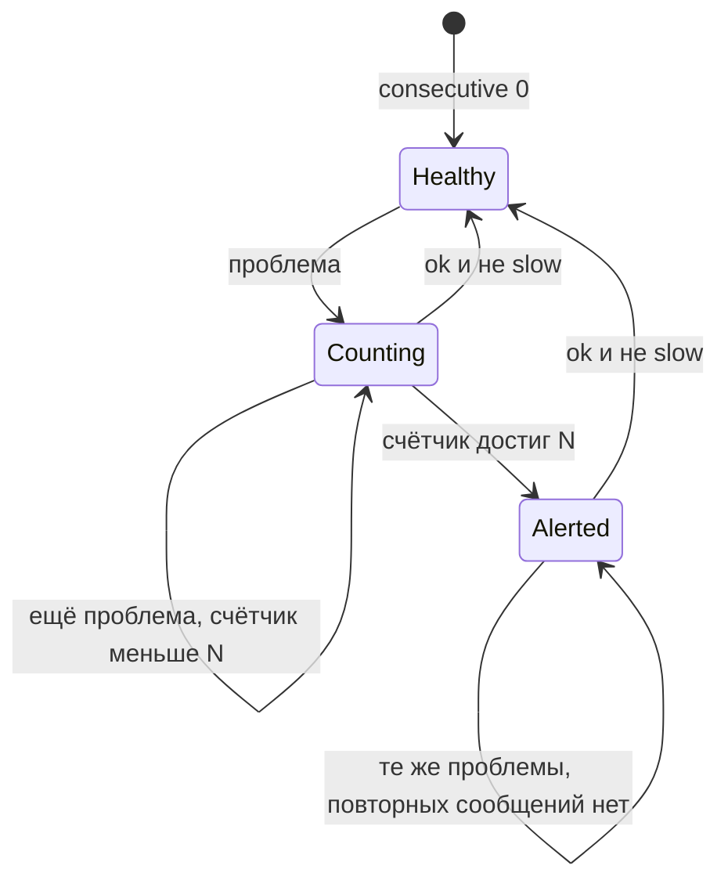
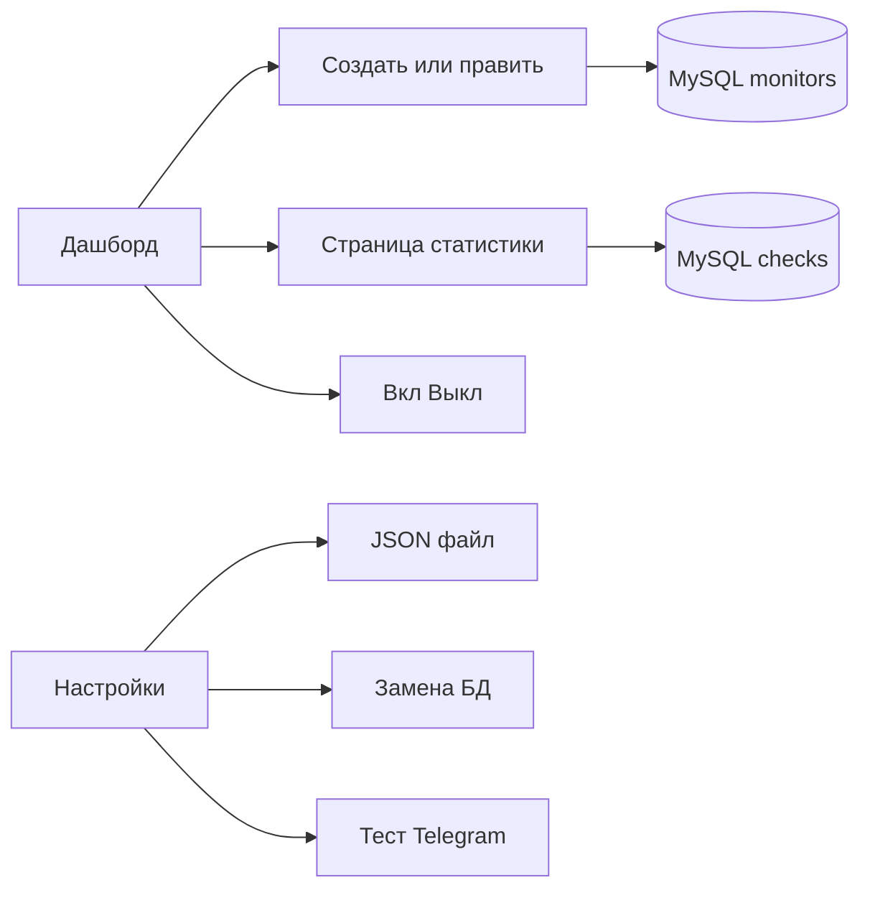

# Логика работы

Документ описывает поведение процесса от старта до алерта и ответа бота.

## Старт

```mermaid
sequenceDiagram
  participant Main
  participant MySQL
  participant Sched as Scheduler
  participant Bot as TelegramBot
  participant HTTP as HttpServer

  Main->>Main: config.Load из env
  loop до 30 попыток
    Main->>MySQL: ping
  end
  Main->>MySQL: миграции
  Main->>Sched: Run в горутине
  alt токен и chat id заданы
    Main->>Bot: RunBot в горутине
  end
  Main->>HTTP: ListenAndServe
  Note over Main: ждёт SIGINT или SIGTERM
```

Пока MySQL не готов, процесс не открывает UI. `/healthz` станет `200 ok` только после ping.

## Цикл проверки URL

Планировщик тикает каждую секунду и заново читает включённые мониторы из БД. Изменение интервала, интервала при ошибке, URL или выключение в UI подхватывается без перезапуска.

```mermaid
flowchart TB
  Tick[Тик 1 секунда]
  Load[ListEnabledMonitors]
  Seed[Инициализация lastRun и lastOK]
  Due{Прошло wait с lastRun?}
  Busy{Этот id уже в полёте?}
  Queue[Поставить в очередь воркеров]
  Skip[Пропустить этот тик]
  Worker[Воркер: GET]
  Save[INSERT checks]
  Alert[alerter.Handle]
  Tick --> Load --> Seed --> Due
  Due -->|нет| Skip
  Due -->|да| Busy
  Busy -->|да| Skip
  Busy -->|нет| Queue --> Worker --> Save --> Alert
```

`wait` зависит от исхода предыдущей проверки:

- успех (`ok = 1`) — ждать `interval_seconds`;
- ошибка (`ok = 0`) — ждать `retry_interval_seconds` (не больше основного интервала, минимум 1 с).

Медленный, но успешный ответ (`ok = 1`, `slow = 1`) использует обычный интервал, не интервал повтора.

Правила очереди:

- один монитор не проверяется параллельно (`inFlight`);
- `lastRun` ставится в момент постановки в очередь, пауза считается между стартами, а не между окончаниями;
- `lastOK` обновляется сразу после GET и задаёт, какой интервал ждать дальше;
- если канал воркеров заполнен, слот снимается и монитор попробуют снова через секунду;
- число воркеров — `CHECKER_WORKERS` (по умолчанию 8);
- редиректы: не больше 5.

Раз в час (и сразу при старте) удаляются проверки старше `STATS_RETENTION_DAYS`.

## Разнесение проверок при старте

Без смещения после рестарта все enabled-мониторы оказывались due в одну секунду: карта `lastRun` в памяти пустая. Пул воркеров только сглаживал пик. Если интервалы одинаковые, всем выставлялся почти один `lastRun`, и пачка повторялась каждый цикл.

Поэтому слот **не** считается «пора проверять», пока для id нет `lastRun`. Сначала выбирается фаза (`internal/scheduler`, функция `initialLastRun`).

```mermaid
flowchart TB
  Missing{id есть в state?}
  Fresh{В checks есть проверка моложе wait?}
  UseDB[lastRun равно checked_at]
  Hash["lastRun = now - wait + id modulo wait"]
  WaitOrRun{now минус lastRun меньше wait?}
  Skip[Ждать следующий тик]
  Enqueue[Поставить GET в очередь]
  Missing -->|да| WaitOrRun
  Missing -->|нет| Fresh
  Fresh -->|да| UseDB --> WaitOrRun
  Fresh -->|нет| Hash --> WaitOrRun
  WaitOrRun -->|да| Skip
  WaitOrRun -->|нет| Enqueue
```

`wait` здесь тот же, что в цикле: после успешной последней проверки — `interval_seconds`, после неуспешной — `retry_interval_seconds`.

Два правила:

1. **Свежая история.** Если последняя строка в `checks` ещё не старше `wait`, `lastRun = checked_at`. После рестарта URL, который проверяли 10 с назад при интервале 60 с, подождёт 50 с, а не уйдёт в пачку вместе со всеми. Если та проверка была ошибкой и `retry_interval_seconds = 10`, подождёт оставшиеся секунды короткого интервала.
2. **Иначе хеш-фаза.** `lastRun = now - wait + (id % wait)` секунд. Нет истории — модуль берётся от основного интервала. Последняя проверка слишком старая — модуль от текущего `wait` (после ошибки это окно повтора).

Примеры при `interval_seconds = 60` и пустой истории:

| id | `id % 60` | Первая проверка после старта |
| --- | --- | --- |
| 60 | 0 | сразу |
| 1 | 1 | через 1 с |
| 30 | 30 | через 30 с |
| 59 | 59 | через 59 с |

У каждого монитора свой модуль: интервал 30 с даёт 30 слотов, интервал 120 с — 120. Смещение детерминированное, после рестарта те же id попадают в те же слоты, если истории нет. Новая запись без `checks` тоже ждёт свой слот, а не стартует мгновенно.

Когда проверка реально ставится в очередь, `lastRun` перезаписывается текущим временем. Дальше работает выбранный интервал (обычный или повтор после ошибки), фазы больше не схлопываются.

Код: [internal/scheduler/scheduler.go](../internal/scheduler/scheduler.go). Поле `retry_interval_seconds` задаётся в форме монитора и хранится в `monitors`.

## Повтор после ошибки

Пока URL отвечает ожидаемым статусом, пауза между проверками — `interval_seconds`. Как только приходит `ok = 0` (сеть, таймаут, чужой статус), следующий старт планируется через `retry_interval_seconds`.

Пример: интервал 60 с, повтор 10 с. Три неудачи подряд занимают примерно 20 с между стартами, а не 120 с. После первого успеха снова 60 с.

Валидация: повтор от 1 с и не больше основного интервала. Пустое или нулевое значение при импорте JSON подставляется как 10 с (и обрезается, если больше интервала).

Существующие базы получают колонку миграцией `002_retry_interval.sql` (DEFAULT 10).

**Важное следствие для алертов.** Порог `fail_threshold` считает проверки, а не время, поэтому короткий интервал повтора ускоряет и алерт. При интервале 60 с, повторе 10 с и пороге 3 сообщение уйдёт примерно через 20 секунд после первой ошибки, а не через две минуты. Если нужна прежняя задержка, увеличьте порог или интервал повтора.

## Как классифицируется ответ

Checker делает `GET` с заголовками `User-Agent: webChecker/1.0` и `Accept: */*`. Таймаут берётся из монитора. Время считается от `Do` до конца чтения тела (не больше 1 МиБ).

```mermaid
flowchart TB
  Get[HTTP GET]
  Err{Ошибка транспорта или таймаут?}
  Status{status равен expected_status?}
  SlowQ{response_ms больше или равен порогу?}
  Down[ok false]
  Up[ok true]
  SlowFlag[slow true]
  Fast[slow false]
  Get --> Err
  Err -->|да| Down
  Err -->|нет| Status
  Status -->|нет| Down
  Status -->|да| Up
  Down --> SlowQ
  Up --> SlowQ
  SlowQ -->|да| SlowFlag
  SlowQ -->|нет| Fast
```

Примеры:

- сайт отвечает `200` за 120 мс при пороге 3000 мс → `ok`, не `slow`;
- сайт отвечает `200` за 4000 мс при пороге 3000 мс → `ok` и `slow` (доступен, но медленный);
- сайт отвечает `500` при ожидаемом `200` → не `ok`;
- таймаут 10 с при пороге 3000 мс → не `ok`, `slow` (время ожидания уже больше порога), `status_code` пустой. В Telegram про такую проверку уходит только «URL недоступен».

Если включён `CHECK_BLOCK_PRIVATE_HOSTS=true`, соединение с адресами внутренних сетей (loopback, приватные диапазоны, link-local) не устанавливается: проверка сразу становится не `ok` с пояснением в `error_text`. Запрет действует на уровне соединения, поэтому перекрывает и редирект на внутренний адрес, и подмену DNS после сохранения URL. По умолчанию выключен — в Docker проверка соседнего контейнера по имени это обычный сценарий.

Дашборд для последней проверки показывает `down`, если не `ok`; иначе `slow`, если медленно; иначе `ok`.

## Алерты Telegram

Алерты — это не «каждое падение», а смена устойчивого состояния. Порог устойчивости — `fail_threshold` монитора (N подряд проблем).

Проблема для счётчика:

- `ok = false`, или
- `slow = true` **и** включён `TELEGRAM_SLOW_ALERTS`.

Если `TELEGRAM_SLOW_ALERTS=false`, медленный успешный ответ счётчик не увеличивает и сообщение «долгий ответ» не уходит.

```mermaid
stateDiagram-v2
  [*] --> Healthy: consecutive 0
  Healthy --> Counting: проблема
  Counting --> Counting: ещё проблема, счётчик меньше N
  Counting --> Alerted: счётчик достиг N
  Alerted --> Alerted: те же проблемы, повторных сообщений нет
  Alerted --> Healthy: ok и не slow
  Counting --> Healthy: ok и не slow
```

При переходе в Alerted:

1. если не `ok` и ещё не `down_alerted` → «URL недоступен»;
2. если проверка **успешна**, но медленная, и ещё не `slow_alerted` → «Долгий ответ».

Сообщение «долгий ответ» уходит только для успешных проверок. При таймауте проверка одновременно не `ok` и `slow`, и раньше в чат улетали два сообщения про один и тот же инцидент; теперь остаётся только «URL недоступен».

При возврате в норму, если раньше был любой алерт → одно сообщение «URL восстановлен», флаги сбрасываются.

Тестовая кнопка в настройках вызывает `Send`, а не `Notify`. Она проверяет доставку в чат и **не требует** `TELEGRAM_ENABLED=true`. Непрошенные алерты требуют и конфигурацию, и `TELEGRAM_ENABLED`.

Команды бота принимаются только из `TELEGRAM_CHAT_ID`. Сообщения из других чатов отбрасываются.

## Команды бота

Long polling: `getUpdates` с таймаутом 25 с. Перед циклом вызывается `deleteWebhook`, чтобы polling не конфликтовал с webhook.

| Ввод | Ответ |
| --- | --- |
| `list`, `/list` | таблица `id \| имя \| url` |
| `stat`, `/stat` | `id \| имя \| статус` |
| `/stat 3`, `/stat3`, `stat_3`, `/stat id=3` | карточка статистики одного URL |
| `help`, `/start` | список команд |

Статистика по id читает монитор, последнюю проверку и агрегаты 24ч/7д. Если id нет — «Монитор N не найден».

## Web-интерфейс

Пользователь работает с теми же таблицами, что и планировщик.

```mermaid
flowchart LR
  Dash[Дашборд] --> Form[Создать или править]
  Dash --> Stats[Страница статистики]
  Dash --> Toggle[Вкл Выкл]
  Form --> Store[(MySQL monitors)]
  Stats --> Checks[(MySQL checks)]
  Settings[Настройки] --> Export[JSON файл]
  Settings --> Import[Замена БД]
  Settings --> TestTG[Тест Telegram]
```

Валидация формы на сервере: схема URL, диапазоны интервала и интервала при ошибке, статуса, таймаута, порога мс и N. Некорректная форма рисуется снова с текстом ошибки, запись в БД не идёт.

График на странице монитора запрашивает `/monitors/{id}/checks.json` (до 200 последних точек) и рисует Chart.js; если библиотека не загрузилась, есть запасной canvas.

### Защита изменяющих запросов

Все методы, кроме `GET`, `HEAD` и `OPTIONS`, проходят через проверку источника (`internal/web/csrf.go`). Basic Auth от CSRF не защищает: браузер сам подставляет сохранённый логин и пароль в запрос, отправленный с чужой страницы, а формы здесь простые и не вызывают preflight. Без проверки посторонний сайт мог бы удалить монитор или запустить импорт, стирающий базу.

Правила такие: если браузер прислал `Sec-Fetch-Site`, принимаются только `same-origin` и `none` (прямая навигация); иначе сверяется `Origin` с `Host`; если нет ни того, ни другого — запрос считается не браузерным (`curl`, скрипт) и проходит. Отклонённый запрос получает `403` с пояснением.

Паника в обработчике перехватывается middleware: клиент получает `500`, стек уходит в лог, процесс продолжает работать.

### Экспорт и импорт

Экспорт пишется потоком прямо в ответ, без сборки дампа в памяти. Две кнопки: «Скачать всё» и «Только настройки» (`/settings/export?checks=0`) — второй режим не включает историю проверок и годится для переноса списка URL.

Импорт читает JSON потоково и вставляет проверки пачками по 500 строк. Файл разбирается в три прохода (версия, мониторы, затем проверки и состояния алертов), поэтому порядок ключей в чужом файле не важен, а мониторы всегда попадают в БД раньше ссылающихся на них проверок. Предел размера — 512 МБ, в памяти держится не больше 8 МБ, остальное уходит во временный файл.

На время импорта планировщик приостанавливается: `Pause` перестаёт ставить новые проверки и ждёт завершения уже запущенных (до 30 с). Без этого `DELETE FROM monitors` внутри транзакции импорта сталкивался бы с `INSERT INTO checks` от воркеров — блокировка или ошибка внешнего ключа. После импорта фазы мониторов пересеиваются из БД, потому что идентификаторы могли поменяться.

## Типичные сценарии

**Добавили URL.** В `state` его ещё нет, истории в `checks` тоже нет → первая проверка в слоте `id % interval` (не обязательно сразу). Дальше — каждый `interval_seconds`, пока проверки успешны.

**URL начал отвечать ошибкой.** Следующая попытка через `retry_interval_seconds`, а не через полный интервал. После восстановления — снова полный интервал.

**Перезапуск процесса.** Свежие `checked_at` восстанавливают фазу из БД. URL без недавней проверки разъезжаются по `id % interval`, а не стартуют все в одну секунду.

**Порог N = 3, сеть моргнула один раз.** Счётчик 1, затем успех сбрасывает его в 0. Telegram молчит.

**Три таймаута подряд.** После третьего — одно сообщение «недоступен». Пока URL лежит, копий нет. Первый нормальный ответ — «восстановлен».

**Экспорт перед обновлением.** «Настройки → Скачать всё». На новой среде — импорт. Планировщик встанет на паузу, заменит данные и продолжит проверять импортированные мониторы; история checks уже в файле. Если история не нужна, берите «Только настройки».

## Наблюдаемость

Логи — `log/slog` в stdout контейнера.

Полезные сообщения:

- `telegram configured=... alerts=... slow_alerts=...` при старте;
- предупреждение, если токен есть, а `TELEGRAM_ENABLED=false`;
- `check problem` при `ok=false` или `slow=true`;
- `telegram alert kind=down|slow|recovery`;
- `telegram alert skipped` если алерты выключены;
- `telegram command ignored: chat id mismatch`;
- `http method=... path=... status=... duration_ms=...` на каждый запрос, кроме `/healthz` и статики;
- `panic in handler` со стеком, если обработчик упал;
- `scheduler paused` / `scheduler resumed` вокруг импорта;
- `deleted old checks count=...` после очистки истории.

`GET /healthz` без пароля удобен для Docker/балансировщика: `200` только при живой БД.
